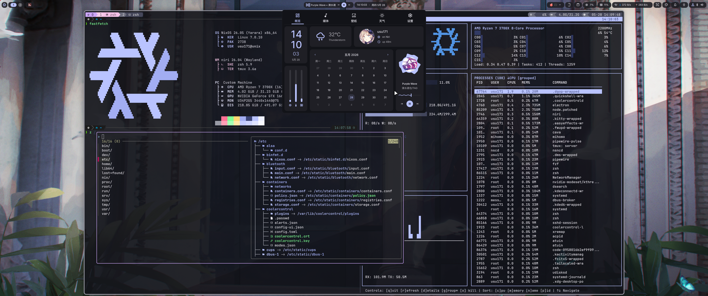

<h2 align="center">Usu171's Nixos Config </h2>


## Hosts

`unix`:
|                 | NixOS                                                                        |
| --------------- | ---------------------------------------------------------------------------- |
| Desktop         | [niri](https://github.com/YaLTeR/niri)+[dms](https://danklinux.com/)         |
| Display Manager | [dankgreeter](https://danklinux.com/docs/dankgreeter/)                       |
| Terminal        | [kitty](https://github.com/kovidgoyal/kitty) [ghostty](https://ghostty.org/) |
| Multiplexer     | [tmux](https://github.com/tmux/tmux/)                                        |
| Shell           | [zsh](https://www.zsh.org/)                                                  |
| Prompt          | [powerlevel10k](https://github.com/romkatv/powerlevel10k)                    |


`nixos`: ~~[KDE Plasma](https://kde.org/plasma-desktop/)~~

`installer`: 安装镜像

`wsl`: wsl

## Screenshots



## Deploy

部署使用[deploy-rs](https://github.com/serokell/deploy-rs)/`nixos-rebuild`/`nh`

> [deploy-rs](https://github.com/serokell/deploy-rs)常见的替代是[colmena](https://github.com/zhaofengli/colmena)

使用[nh](https://github.com/nix-community/nh)替代`nixos-rebuild`, `nix-collect-garbage` ...）  
[nom](https://github.com/maralorn/nix-output-monitor)替代`nix build`

## Code

编辑器主要用[VS Code](https://code.visualstudio.com/)

language server使用[nixd](https://github.com/nix-community/nixd)或[nil](https://github.com/oxalica/nil)

使用[treefmt-nix](https://github.com/numtide/treefmt-nix)进行格式化
```bash
nix fmt
nix flake check
```

- [nixfmt](https://github.com/NixOS/nixfmt)
- [deadnix](https://github.com/astro/deadnix)
- [statix](https://github.com/oppiliappan/statix)

## Just

使用[Just](https://github.com/casey/just)简化命令

## Shell

`old/`内存放了不依赖Nix的tmux配置([tpm](https://github.com/tmux-plugins/tpm))和zsh插件配置([zinit](https://github.com/zdharma-continuum/zinit))

# 参考

- [NixOS & Flakes Book | 主页](https://nixos-and-flakes.thiscute.world/zh/)
- [Zero to Nix](https://zero-to-nix.com/)


## nix相关资源/项目列表
- [nix-community/awesome-nix: 😎 A curated list of the best resources in the Nix community \[maintainer=@cyntheticfox\]](https://github.com/nix-community/awesome-nix)
- [我的浏览器收藏夹 //软件/Nix](https://github.com/Usu171/favorites)

## 配置
- [ryan4yin/nix-config: ❄️ My nix config for both desktops(NixOS+macOS) and homelab servers(NixOS).](https://github.com/ryan4yin/nix-config)
- [ryan4yin/nix-config at i3-kickstarter](https://github.com/ryan4yin/nix-config/tree/i3-kickstarter)

## 运行未修补的程序
- [运行非 NixOS 的二进制文件 | NixOS & Flakes Book](https://nixos-and-flakes.thiscute.world/zh/best-practices/run-downloaded-binaries-on-nixos)
- [Different methods to run a non-nixos executable on Nixos - Unix & Linux Stack Exchange](https://unix.stackexchange.com/questions/522822/different-methods-to-run-a-non-nixos-executable-on-nixos)

## 桌面, fastfetch
参考 [SHORiN-KiWATA](https://github.com/SHORiN-KiWATA)
- [SHORiN-KiWATA/shorin-arch-setup: 一键配置archlinux桌面环境](https://github.com/SHORiN-KiWATA/shorin-arch-setup)
- [SHORiN-KiWATA/Shorin-ArchLinux-Guide: 【2026最适合新手的Arch Linux教程】具体内容包括：系统安装教程、win+linux双系统、N卡驱动、桌面环境、中文输入法、Linux玩游戏、常用虚拟机程序、显卡直通、干净删除linux等。](https://github.com/SHORiN-KiWATA/Shorin-ArchLinux-Guide)

***

[头像](https://x.com/Aetherophasic_0/status/1958198314530119954/photo/1) [作者 Etherｰ0](https://x.com/Aetherophasic_0)  
[壁纸](https://www.pixiv.net/artworks/81070180) [作者 Sagiri](https://www.pixiv.net/users/11151341)
